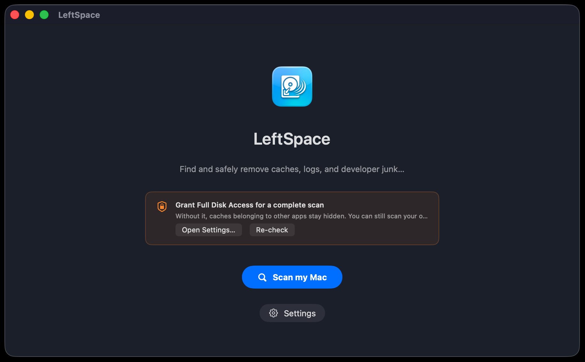
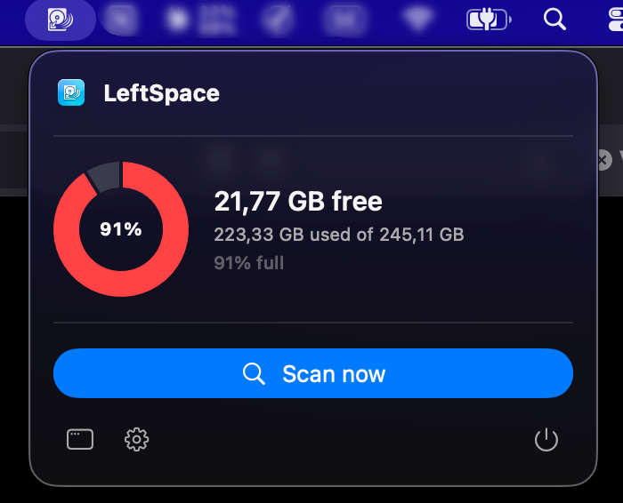

# LeftSpace

**One app that cleans the everyday junk and the developer junk, so a developer doesn't need five tools, and a regular user still gets value.**

[](https://github.com/batwolf-commits/leftspace/releases/latest)
[](https://github.com/batwolf-commits/leftspace/releases)


[](LICENSE)

LeftSpace finds the gigabytes of cache, log, and leftover files that Finder hides,
especially developer-tool caches like npm, Gradle, Xcode DerivedData, and
`node_modules`, and removes them **safely**. Move to Trash by default, with a hard
safety guard that can never touch your documents, photos, or system files.

macOS 14+ · Apple Silicon and Intel · free.

### ⬇️ [Download the latest release](https://github.com/batwolf-commits/leftspace/releases/latest)



## Why LeftSpace

Most Mac cleaners handle everyday app caches but are blind to where a developer's
space actually goes. The dev-only tools are fragmented and CLI-only. LeftSpace does
**both**, in one native app, safely:

- **Developer caches:** npm, Bun, Yarn, pnpm, pip, Gradle, Maven, Homebrew,
  Xcode DerivedData, CoreSimulator, `~/.cache`.
- **Everyday junk:** application caches, logs, saved app state, Trash.
- **Project build artifacts:** `node_modules`, virtualenvs, build folders in your
  projects.
- **App leftovers:** files left behind by apps you've already deleted.

A menu bar widget gives you a quick disk overview and a one-click clean without
opening the full window:



## Safety first

- **Trash-first by default.** Everything is recoverable until you empty the Trash.
  Permanent delete is an explicit, confirmed opt-in.
- **A hard safety guard** (`ProtectedPaths`) physically refuses to ever target
  Documents, Desktop, Photos, iCloud Drive, system files, or device backups.
  Every deletion candidate passes through it.
- **It explains everything.** Each item shows its path, real on-disk size, and a
  plain reason it's safe, tagged Safe / Review / Risky. Only Safe is pre-selected.
- **Undo** after a clean, plus an honest before/after disk gauge. Moving to Trash
  doesn't free space until it's emptied, and LeftSpace tells you that.

## Install

1. Download the latest `LeftSpace-x.y.z.dmg` from the
   [**Releases**](../../releases) page.
2. Open the DMG and drag **LeftSpace** to your **Applications** folder.
3. **First launch (important):** LeftSpace isn't notarized yet, so macOS will warn
   the first time. Either:
   - **Right-click** the app, choose **Open**, then **Open** again, or
   - if macOS says it "is damaged / can't be opened," clear the download flag once:
     ```sh
     xattr -dr com.apple.quarantine /Applications/LeftSpace.app
     ```
4. *(Optional)* For a complete scan of other apps' caches, grant **Full Disk
   Access** when prompted (System Settings → Privacy & Security → Full Disk Access).

> Notarized, one-click installs are planned. This manual step will go away then.

## Build from source

Requires the Swift toolchain (Xcode or Command Line Tools), macOS 14+.

```sh
swift build                 # build everything
swift test                  # run the safety-guard tests
./Scripts/make-app.sh release   # assemble build/LeftSpace.app
./Scripts/package-dmg.sh        # build dist/LeftSpace-x.y.z.dmg
```

There's also a CLI for trying the engine without the app:

```sh
swift run storagecleaner scan          # scan and report, no changes
swift run storagecleaner clean --yes   # move SAFE items to Trash
swift run storagecleaner check <path>  # ask the safety guard about a path
```

## Support

LeftSpace is free. If it reclaimed some space for you, a tip helps keep it going:
[**buymeacoffee.com/bhathiya**](https://buymeacoffee.com/bhathiya).

Ideas or bugs: **bhathiyaapps@gmail.com** or open an
[issue](../../issues).

## License

[MIT](LICENSE) © Bhathiya
